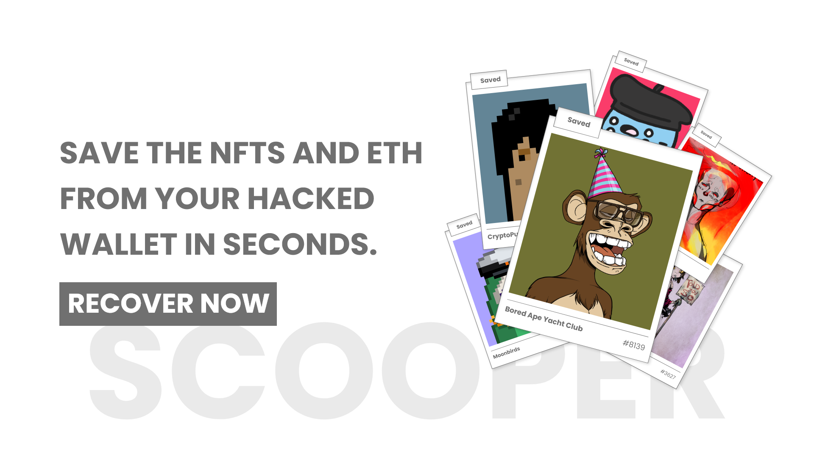
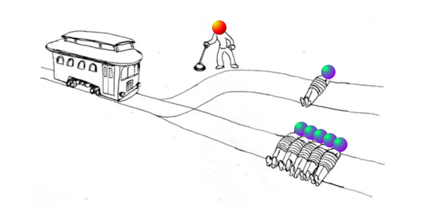

# Scooper: A NFT Recovery Tool For The Public



## How Digital Assets (NFTs and Ethereum) Are Lost

In the land of digital assets it has become increasingly more common for someone to have their Ethereum wallet compromised while being left with very few options for recovery. Ethereum wallets operate very similar to real-world vaults. Without the secret code it will take an army to gain access however with the proper string of characters that vault will swing wide-open at a moments notice.

This is how individuals land themselves in the scenario of watching all their assets disappear in front of their eyes.

When a scammer gets hold of ones private key they have full control over that wallet. It does not matter if that wallet is a Ledger or any other kind of hardware wallet. With access to the private key, any individual can walk in any say "this is my wallet" in just a few seconds. Whether you receive an airdrop, sign a malicious transaction, enter your private key somewhere you shouldn't; the end result will always be the same. A laundry list of at-risk assets held within that compromised wallet. 

This articles goes into how to prevent that, how the wallet sweepers actually work and what you can do if you find yourself in the situation of having a compromised wallet that has assets you need to save.

## The Unfortunate Damage of Sweepers

To start, a general wallet sweeper is a script that values the assets within a compromised wallet and then siphons each asset to an account that the bad-actor controls. Unfortunately for many, these scripts are extremely efficient and excel at identifying and selling the things of highest value as fast as possible.

### How Sweepers Work

A sweeper doesn't stop there though. A sweeper is also going to put an incredible amount of effort in preventing you from running a transaction any way that they can.

For Ethereum, all transactions are put into the public mempool where anyone can see the transactions that are yet to be confirmed. Because all transactions in the mempool can be seen while pending, we (and scammer) have the ability to watch for incoming funds. When a sweeper sees one of these transactions, they know to run a transaction with a higher gas limit so that their transaction will front-run the owners. With this, the nonce of the submitted transactions by the proper owner are now invalid and will fail when processed. So, even if a user has a compromised wallet and they send Ethereum that is going to be used to transfer out tokens, those newly deposited funds will vanish as quickly as it appears.

The means of doing so will be forever-evolving. In general, a wallet sweeper operates much like one would expect and that will likely remain true for the forseeable future. It sweeps everything out of the wallet and will continue to do so until it is no longer profitable. 

### How To Stop Sweeping

Just because the sweeper scripts in the industry have evolved, does not mean there are zero options or ways to protect the assets within your Ethereum wallet.

Like your sex education teacher said, abstinence is the only fool-proof method of prevention. Speaking very generally, there is absolutely zero reason that you need access to your private key.

For degens this situation is entirely unavoidable and while being dogmatic with the recommendation of "just be better" is enough to some, Scooper aims to address this market rather than turning a blind eye.

### The Dire Conditions

In general, the only way to stop a scammer from draining an account that they have access to is burning/removing all funds that are held in that wallet. If there is Ethereum sitting in that wallet, there is money to cover the cost of transactions.

For many, this leads to the situation of needing the ability to send Ethereum to a wallet without the sweeper seeing the incoming transaction. After all, you can't transfer the tokens either if the wallet doesn't have funds.

## Improving The Odds of Recovery

Previously, this meant launching a simple contract that sends money to the compromised wallet and then self-destructs like: 

```
pragma solidity 0.8.9;

contract Scooper {
    constructor(address compromised) payable {
        address payable compromised = payable(address(compromised))
        selfdestruct(compromised)
    }
}
```

By deploying this contract an individual could not only fund the compromised wallet, but do so in a way that makes it more difficult for a low-quality sweeper to intervene. Still though, the problem isn't magically fixed because a half-decent sweeper will be watching the balance of every account like a hawk. When money is added, money is drained.

Though, without the ability to immediately process the subsequent transactions after the initial funding, the funding often results in more assets being stolen. By adding funds the scammer can instantly use it to transfer out the tokens and leave you in the exact same position you were.

Unfortunately for almost everyone, this nuanced outcome is seen no matter the number or type of attempts made. Realistically, there is very little that we can do manually.

This does leave us with the option of running a 'Guardian' that immediately cleans out all of the ETH sitting in an account.

Thankfully, this is rather simple to do. For one, this is a rather simple script that allows one to watch for incoming transactions and immediately remove the ETH sent to the wallet being protected. This will not stop more sophisticated bots however extra protection is always better than none! Especially when pressure and adrenaline is high with value assets at risk.

In 2022, thankfully there are more and better options than watching the assets get drained out of the account. To fully understand this though, it is important we take a look at the few viable options and then we can dive into the way that Scooper is structured and why.

To start, instead of needing to deploy a contract just to fund the wallet (and still leaving the funds and assets at risk) there are far simpler methods.

Currently, we live in a world where the rules can be bent a little. Meaning, in most cases ETH is required for a transaction to be mined (as transaction fees are paid for by the sender). Today though a 'Sponsor Wallet' can be used with a simple 'bribe' to the miner with funds from the forwarder contract that covers the cost of running an-already signed transaction from the compromised wallet.

With this, we can run a transaction (save the assets at risk) without putting ETH at risk or needing to cover the cost of gas.

## The Difficulty of NFTs

Running a sponsored transaction is not something that everyone can do themselves. With NFTs, this has even further feasibility hurdles. The flexibility of our process gets tightened to a certain degree as the recovery method becomes more complex. Additionally, as every NFT requires an approval transaction (when being moved by someone other than the owner), immediately the cost of saving anything is doubled.

Unfortunately, token theft gets much harder to stop as we begin building a website or front-end solution that lowers the barrier of entry. By running everything through a forwarder contract it is an absolute requirement that an:

* approval transaction is ran on each collection.

* transfer function to safe wallet.

So if you even have 30 NFTs in your wallet that is immediately 60 transactions that you to send. The amount of time needed adds up incredibly quickly. While this is a feasible and very good solution for a developer that can handle things themselves. For the general user this is incredibly infeasible.

## Solving The Problem 



Because of this, Scooper is designed around sharing the private key to the compromised wallet and the sponsor wallet. While this model may be an 'anti-pattern' to some, this method allows one to save the most of their assets in the least amount of time. 

> **It is highly advised against using the compromised wallet or the sponsor wallet after using Scooper.**

With this, no longer do we have to run approval transactions nor do we have to sign an incredible amount of transactions. This means, that as you fill in the data that is needed the system can most efficiently save the things that you care most about.

A major difference here being that without a forwarder contract we now face the requirement of funding the account with the needed ETH to cover the cost of the transfer transactions. This is not a deal breaker though. With Flashbots, every bundle of transactions can be simulated before being submit to the chain. This allows the amazing luxury of not only avoiding failed transactions, but immediately we can calculate what the cost of gas will be. With this we can introduce a function transaction and be on our merry way. Again, all without you having to do anything. So, a sponsor wallet is still needed to safely provide the funds without putting them at risk.

With everything taking place in the background all you have to do is:

1. Enter the private key of the compromised wallet.
2. Enter the private key of the sponsor wallet.
3. Choose the non-compromised recipient wallet.
4. Choose the NFTs.
5. Scoop the tokens into the chosen recipient.

With that setup, Scooper will get to work and recover the assets from a compromised wallet as fast as possible. As things progress everything will be output to the console. Finally, when the recovery is successful you'll get a quick summary of all the actions completed.

Just like that, anyone that has the ability to use a website can finally recover the assets that are at-risk with minimal effort. With updates in the future, Scooper will be there to help anyone that lands them in this less than ideal scenario.

---

## Roadmap

Scooper is an entirely experimental tool and there are never any guarantees for any feature or development. Things evolve rapidly in this space and new technologies emerge every day. Please keep this in mind when considering the existing roadmap or requesting a feature.

- [ ] Guardian Mode
- [ ] Custom Token Transfer Amounts
- [ ] ERC20s
- [ ] Custom Transactions
- [ ] Non-Private Key Version

---

# The Code Environment

Scooper is entirely open-source so that anyone can make sure that code is secure or even run the code locally themselves. Scooper is designed to lower the barrier of recovery as quickly as possible for everyone.

* Please note: There is no tech support for this. If you cannot figure out how to run the project and utilize things, I would recommend using the publicly-hosted version at: https://scooper.utc24.io.

## Environment Setup

Before running the server an ENV file needs to be created with the appropriate fields. A list of all the required fields can be found by looking at `example.env` in both `/api` and `/frontend`.

## Available Scripts

## API
In the api directory, you can run:

### `npm run start`

Runs the app.\
Open [http://localhost:8080](http://localhost:8080) to view it in your browser.

You must also have the API running before running the front-end as it is the backend proxy.

## Frontend
In the frontend directory, you can run:

### `npm run start`

Runs the app in the development mode.\
Open [http://localhost:3000](http://localhost:3000) to view it in your browser.

The page will reload when you make changes.\
You may also see any lint errors in the console.

### `npm run build`

Builds the app for production to the `build` folder.\
It correctly bundles React in production mode and optimizes the build for the best performance.

The build is minified and the filenames include the hashes.\
Your app is ready to be deployed!

See the section about [deployment](https://facebook.github.io/create-react-app/docs/deployment) for more information.